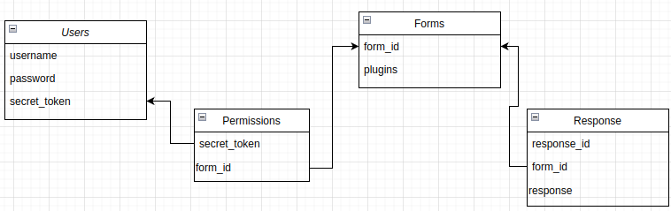

# Nexus Forms
A **Data Collection Platform** with the support of plugins in plug-n-play fashion.

## How To Use
* Install DynamoDB locally and start on port 8000.
* Install the Dependencies mentioned in __package.json__ file.
* Start the server on port 3000 using the command:
```
    node ./controllers/index.mjs
```
* Use Postman to give the HTTP requests to our server.

## POST REQUEST APIs
* /register: Takes username and password and return the secret token.
* /forms/create: Takes username, secret token and plugins name (to be plugged in the form) and return the form_id of the created form.
* /forms/:form_id/send_response: Takes secret_token and response (to be recorded) and returns the status of the record.

## Design Specifications
### Database
**Dynamodb** is used as database due to following reasons:

* Schema Flexibility - Forms can be made with different schema. Anyone from governments delivering vaccines to small business owners managing their daily inventory, to a zoo monitoring a rare wildlife species.
* High Performance - NoSQL databases offer high performance (concurrent operations) over SQL. Moreover, Dynamodb hs very less latency.
* High Scalability - Dynamodb is auto-scalable with no load on developers.
* High Consistency - Dynamodb offers two consistency models for read operations: eventually consistent reads and strongly consistent reads.
* Fault Tolerance - Dynamodb is designed as fault tolerant.

### Database Schema


### Plugins
Plugins are designed in the view of comfort for backend as well as client. They can be used as plug n play fashion.

* **Developer End** -> They only need to make a new module inside the plugins directory. Create a new class extending the Plugin base class and override two methods:
    1. *validationChecks*: Validate the request as per the plugin requirement. If validation fails, the request is aborted and the error message is sent to the user.
    2. *run*: The actual operation the plugin needs to perform. This runs only when all the validation checks are passed and the response is recorded sucessfully.
* **Client End** -> Client only needs to specify the list of plugin names (in the body of request) to be used for each of the particular form.

Current Plugins: Google Sheet Plugin and Email Plugin

While creating the Google Sheet, it must be shared with the email id provided by the user so that he can get the permission to access the Google Sheet.

### Security
* Secret Token is generated and combined with username is used for the authentication.
* Permissions are recorded, about a particular form which users have the permission to send the response into.
* Teams can also be managed without any security compromise. 

## Enhancements Required
For now, I have made the service to be used locally. But we could also deploy it on cloud (AWS/Azure) by publishing its docker image.
### Microservice Architecture
Microservice Architecture is preferred for different types of services:
* User Registration
* Form Creation
* Response Collection
* Plugins Handler

Microservice Architecture involves loosely coupled services working independently enhancing the modularity, fault isolation and scalability.

### Other Specifications
Since there are massive number of clients using our service with a lot of responses, system can be made scalable.
* **Load Balancer** can be used to balance load across different services. This will prevent the imbalance of request load at each service.
* Message Queues can be used for asynchronous nature of request. **Kafka** can be used since it provides more functionality than a normal message queue including fault tolerance.
* **ELK stack (Elasticsearch, Logstash, Kibana)** can be used to monitor resource usage as it records the log generated by the resources. **Kibana** or **Splunk** can be used to analyze the logs by extracting valuable insights.
* This type of monitoring will help to decide about the scalability of services.
